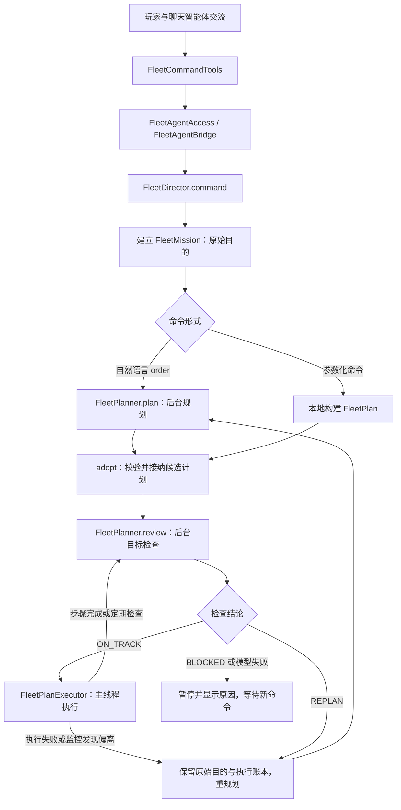

# fleet-agent 源码工作原理

这个模块负责一支从玩家舰队分出的墨汁舰队。聊天智能体接收玩家意图并委派任务；舰队智能体把任务变成步骤，在战役更新中逐步执行，再检查是否仍符合原始目的。

## 先看哪些文件

建议按这个顺序读，暂时不用钻进库存与报价细节：

1. [`FleetDirector.command()`](../src/main/java/com/mozhi/fleet/FleetDirector.java)：命令怎么进来，以及直接命令和自然语言委派的区别。
2. [`model/FleetMission`](../src/main/java/com/mozhi/fleet/model/FleetMission.java)、[`model/FleetPlan`](../src/main/java/com/mozhi/fleet/model/FleetPlan.java)、[`model/FleetPlanStep`](../src/main/java/com/mozhi/fleet/model/FleetPlanStep.java)：先认识任务、计划和步骤。
3. [`planning/FleetPlanner`](../src/main/java/com/mozhi/fleet/planning/FleetPlanner.java)：模型如何输出计划和检查结论。
4. `FleetDirector.submit()`、`consumePlan()`、`advance()`：后台结果怎么回到游戏循环。
5. [`execution/FleetPlanExecutor`](../src/main/java/com/mozhi/fleet/execution/FleetPlanExecutor.java)：每种行动实际怎样执行、怎样判断完成。
6. `FleetDirector.replan()` 和 [`execution/FleetExecutionMonitor`](../src/main/java/com/mozhi/fleet/execution/FleetExecutionMonitor.java)：失败、停滞或目标偏离时怎样处理。

## 目录与职责

| 位置 | 类 | 负责的事 |
| --- | --- | --- |
| 根包 | `FleetDirector` | 唯一游戏加载入口，实现 `FleetAgentBridge`；协调命令、后台请求、主线程执行、状态展示和保存 |
| `model` | `FleetMission` | 原始目的、授权行动、执行账本、检查结论和重规划次数 |
| `model` | `FleetPlan` | 当前计划、步骤顺序、当前下标、整体进度与业务规则校验 |
| `model` | `FleetPlanStep` | 一个行动的参数，以及实际目标 ID、进度、状态、结果 |
| `model` | `FleetState` | 聚合舰队 ID、任务、计划、时间、日志；恢复旧版存档 |
| `planning` | `FleetPlanner` | 创建 `LlmClient`，调用类型化 AI Service，转换并校验结果 |
| `planning` | `FleetPlanningService` | 规划提示词与 `plan()` 接口，返回 `FleetPlanDraft` |
| `planning` | `FleetPlanDraft`、`FleetPlanStepDraft` | 模型生成的计划定义，不包含运行进度；转换为执行对象 |
| `planning` | `FleetGoalReviewService`、`FleetGoalReview` | 目标检查提示词与结果：继续、重规划、阻塞 |
| `execution` | `FleetPlanExecutor` | 按顺序执行行动，确认真实效果后完成步骤 |
| `execution` | `FleetExecutionMonitor` | 检查原生任务目标被覆盖、航行长期停滞等可直接观察的偏离 |
| `game` | `FleetWorld` | 查询实际舰队、计算距离、维护原生任务、判断环绕、描述物资 |
| `game` | `FleetDestinations` | 用名字或 ID 解析星球、星系、市场；执行时固定实际实体 ID |
| `game` | `FleetTransfer` | 从玩家分出指定舰船和资源；靠近玩家后合并资产 |
| `trade` | `FleetTrading` | 执行当次读取库存、报价、检查数量和余额、转移实物、结算与回滚 |
| `trade` | `FleetTradeInventory` | 把不同货物和舰船统一成库存条目，按名称或 ID 匹配；仅供交易包内部使用 |
| `config` | `FleetSupervisionConfig` | 检查间隔、停滞时限、自动重规划上限 |

这些包都在同一个 `fleet-agent.jar` 内。跨包调用所需的类和方法为 `public`，库存条目、转换细节和内部辅助方法仍限制在所属包或类内。

## 从聊天到游戏执行

外层桥接代码属于其他模块：聊天工具在 `agent-runtime`，`FleetAgentHost` 和 `FleetAgentBridge` 在 `bootstrap`。Host 用私有类加载器创建 `com.mozhi.fleet.FleetDirector`，战役更新时调用其 `advance()`；UI 通过 `view()` 读取状态。

参数化命令已经给出明确行动，例如跟随三天或立即召回，代码直接建立计划。自然语言 `order` 需要模型把目的拆成步骤。两种计划在执行前都会经过目标检查。

## 四种数据对象为什么分开

假设玩家说：“去 Jangala 买 100 个补给，然后回来合并。”

- `FleetMission.originalGoal` 保存这句原始要求。整个任务的重规划不会改写它。
- `FleetPlanDraft` 是模型建议：`MOVE_TO → BUY → RETURN`。它只包含行动定义，模型不能填写实际交易结果或已完成进度。
- `FleetPlan` 是经过校验、准备执行的计划。`currentStep` 指向正在执行的步骤。
- `FleetState` 把舰队 ID、这个任务、这个计划和日志放在一起，供 UI 和存档使用。

任务与计划的关系是“一项原始任务，可以经历多份计划”。例如买完补给后返航被打断，新的计划应只处理剩余返航，不能再买一次。

首次检查通过的行动会记录到 `mission.objectives`，每项都有 `objectiveId`。已完成交易和跟随进度记入 `mission.receipts`。重规划步骤必须引用原授权目标，本地校验会拒绝额外购买数量、重复交易、擅自改变市场或品种。语义上是否遗漏了玩家目的，仍由模型检查。

## Plan：模型负责建议行动

`FleetDirector.submit()` 在游戏主线程读取当前状态，整理成一段 JSON 文本，其中包含原始要求、任务与账本、当前状态、触发原因。后台线程只接收这段文本，不接收可变的游戏对象。

`FleetPlanner` 通过 `llm-client` 的 `LlmClient.aiService()` 创建 LangChain4j 接口。规划返回 `FleetPlanDraft`，检查返回 `FleetGoalReview`；框架负责结构化转换，业务代码负责验证行动顺序和数值。

`FleetPlanDraft.toPlan()` 将草案变成计划，并校验最多八步、召回必须最后执行、无限跟随必须最后执行等规则。`adopt()` 再核对剩余授权目标，初始化本地执行状态，然后先提交检查。

模型连接、输出预算、思考参数和结构化输出模式沿用 `agent.properties`。空正文的识别和有限重试在 `llm-client` 中处理；失败不会被当作检查通过。

## Execute：游戏循环负责真正做事

`advance()` 每次游戏更新先处理已完成的模型请求。未暂停时累计游戏时间，每约 `0.05` 个游戏日推进一次控制逻辑。正在规划或检查时不推进步骤、不交易，已有原生航行仍可能继续。

`FleetPlanExecutor` 只执行 `plan.current()`，完成后推进下标；一次控制更新不会连续执行所有后续步骤。

| 行动 | 执行与完成条件 |
| --- | --- |
| `FOLLOW_PLAYER` | 持续向玩家下达原生移动任务；只有实际跟上时才累计指定时长，时长为零则持续跟随 |
| `MOVE_TO` | 先航行，靠近后下达 `ORBIT_PASSIVE`；读取真实 `OrbitAPI` 确认环绕对应实体后才完成 |
| `BUY` / `SELL` | 必须已经环绕指定市场；不包含导航。按当前真实库存转移货物或舰船并结算信用点，成功后完成 |
| `RETURN` | 返回并靠近玩家，双方结束战斗和跃迁后，实际转回舰船、军官、货物和资金，再移除分舰队 |

所以上面的例子必须先完成 Jangala 的 `MOVE_TO`，才执行购买。只是进入 Corvus 星系、靠近市场或下达环绕任务，都不算已经入轨。

交易读取的是执行时商店的 `CargoAPI` 与封存舰船，真实对象从商店移到分舰队；不会根据旧库存记录生成替代商品。数量或信用点不够时不部分成交，也不会自动添加储备资金、补给或 CR 策略。

## Review 与 Replan：检查原始目的

新计划执行前、每一步完成后、长步骤执行期间都会检查。定期检查同时受到游戏日数和实际秒数限制；步骤完成等事件检查不受定期限频限制。

`FleetGoalReview` 有三种结论：

- `ON_TRACK`：计划及结果仍符合原始目的，继续执行；全部步骤完成且最终检查通过，任务才记为完成。
- `REPLAN`：保留原始目的和实际执行账本，取消旧计划，重新规划剩余工作。
- `BLOCKED`：当前缺少必要指令或无法完成，暂停并展示原因，等待玩家下达新命令。

此外，`FleetExecutionMonitor` 不调用模型，直接检查任务被覆盖、长期没有接近目标等现象。它发现偏离，或执行器报错，也会触发 `replan()`。正常航行、战斗或跃迁等待不会直接被当作停滞。

重规划达到次数上限、模型调用失败，或交易回滚无法确认时也会阻塞。特别是资产变化不确定时，代码不会自动重试交易。

## 线程、取消与存档

游戏主线程负责接收命令、读取世界、执行步骤、交易和保存；单独的 `Mozhi-Fleet-Planner` 后台线程只负责模型调用。这样网络等待不会阻塞游戏线程，也不会从后台修改舰队。

新指令会递增 `state.revision` 并建立新的任务 ID。每个模型请求记住提交时的版本和任务 ID；`consumePlan()` 会丢弃不属于当前任务的回复。取消旧命令不会撤销已经发生的购买或出售。

`save()` 将 `FleetState` 序列化为普通 JSON 字符串，保存到战役的 `persistentData`。JSON 中不写 Java 类名，因此本次子包重排不需要改变存档版本。实际舰船、货物和军官仍由游戏自己的存档保存，模块通过 `fleetId` 找回它们。

读档恢复任务和执行进度，并重新提交尚未结束的规划、检查或重规划请求。聊天的新对话不会清掉分舰队任务。UI 显示的是 `view()` 提供的状态副本，包括原始目的、当前步骤、检查原因和最近动态。
